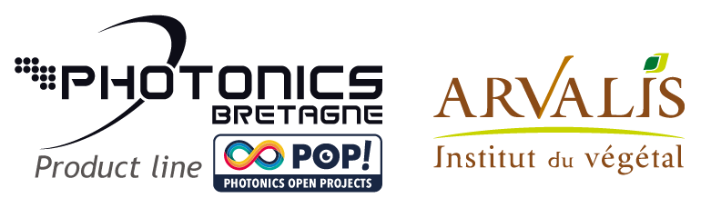

============
Introduction
============

The ONE-PIX kit is a low-cost single-pixel hyperspectral imaging education kit. This module is fully available on Github (see `here <https://github.com/IanHarvey/bluepy/>`_)
The current implementation has been developed in Python 3 and tested on a Raspberry Pi 4 8 Go, running Raspbian 11 (bullseye), but should also work with Windows or Ubuntu on most computers.

.. image:: ../../../imgs/ONEPIX_kit.JPG
  :width: 400
  :align: middle
  :alt: ONE-PIX kit

Motivations
------------
As the various spectral imaging technologies are relatively very expensive, we want to popularise the use of these new cutting-edge technologies. Thus, this kit aims to allow anyone to design their own kit or to order one from Photonics Bretagne.
As this research topic remains very broad, a Github repository allows to share all the contributions made within a community dedicated to single-pixel hyperspectral imaging.

This package is intended to provide 
--------------------------------------------

- Python scripts for interfacing the kit.
- Scripts implementing various compressed imaging methods
