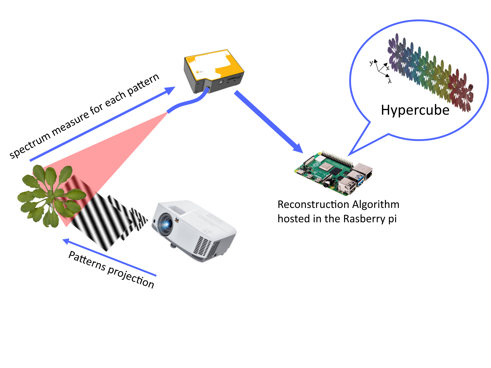
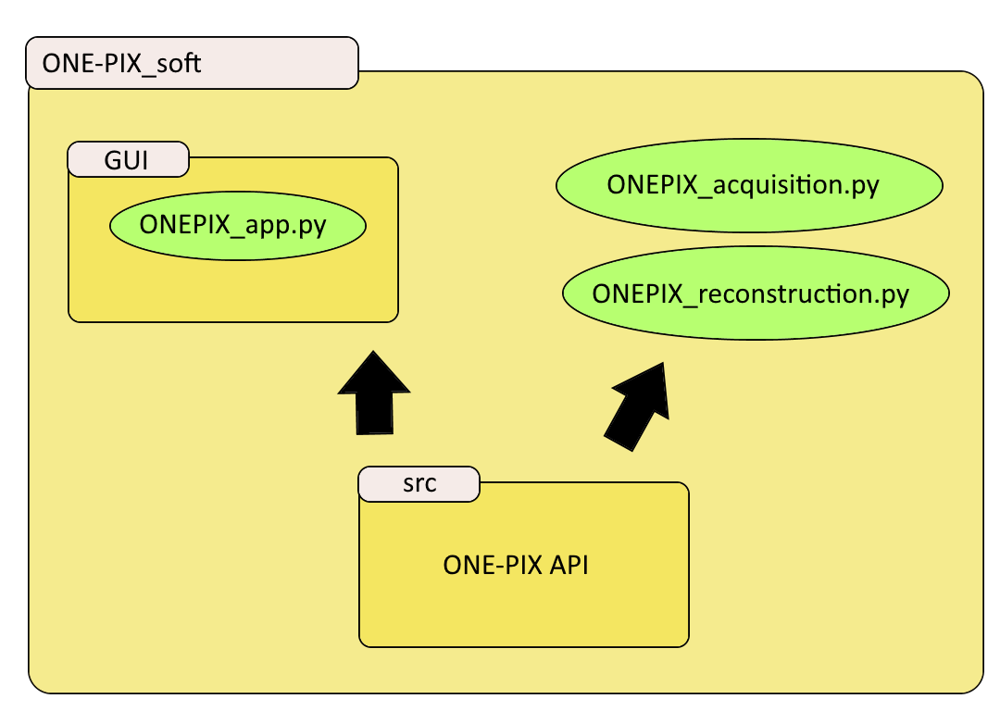

# Readme of the ONE-PIX kit project repository  #

## General
### Introduction 

The ONE-PIX kit is an hyperspectral camera using single pixel imaging principle to measure hypercubes in visible region. It can be enhanced towards the infrared region. This modular kit can be used with different spectrometers and optical elements for the collection. To date, it can measure with ambiant light but is was mainly tested and develop for indoor uses.

This kit is ideal for getting started with hyperspectral imaging or single pixel imaging. Thus it is a tool for teachers and students to discover non conventional imaging. It is also an economic tool to produce low cost hypercubes of tailored scenes or to reproduce academical results within the robotic vision field. 
To learn more about single pixel imaging theory used for hyperspectral imaging, read our [article. ](https://www.ncbi.nlm.nih.gov/pmc/articles/PMC7070961/)

This kit was developped with in our mind the primary necessity to be capable of being asssembled it on a standard fablab with a lasercut. Few wirring (all low voltage) and no soldering are necessary. You should found in your neighbourhood a fablab capable (and enthousiast) to help you building this cool artifact, especially  if they can play with it a little afterward.^^

### License

This kit is distributed under CC-by license that you can consult [here ](https://en.wikipedia.org/wiki/Creative_Commons_license). 

### Working principle

The ONE-PIX kit contains a projector and a fibered spectrometer with superimposed field of views. Both are connected and driven by a Raspberry Pi board.
 

ONE-PIX technology involves projecting a series of patterns onto a scene to be imaged. A spectrometer measures the average reflected spectrum of the scene for each projection. An algorithm then reconstructs the hypercube of the scene from all the spectra measured during the acquisition.
The Raspberry Pi board ensures the synchronization between patterns projections and the spectrometer measurements. 

### Architecture of the ONE-PIX kit repository 

The ONE-PIX kit project contains two folders :

- A [hardware build folder](hardware_build) contains all the files and information to build a case containing all the components of the ONE-PIX kit and their 3D printed attachments.
- A [ONE-PIX Software folder](ONE-PIX_soft) contains the scripts and software embedded on the Raspberry Pi and all the information to install and use it properly. 
## Steps to produce one ONE-PIX kit

These followings steps are presented in chronological order to create a ONE-PIX kit. 

### Build your own hardware ONE-PIX kit

Every informations and files to build your own hardware kit are avalaible in the [hardware build folder](hardware_build)

This folder contains:

- The [material needed list](hardware_build/materials_needed.pdf) file containing raw materials and equipments needed to build the ONE-PIX kit hardware.
- The [hardware building tutorial](hardware_build/hardware_building_tutorial.pdf) file containing details steps to build the ONE-PIX kit.
- [STL files ready to 3D_printing](hardware_build/STL_file_ready_to_3D_printing) folder containing every files to 3D print components fixation parts of the kit.
- [plans of box sides ready to cut](hardware_build/plan_of_box_sides_ready_to_cut) folder containing every files to  laser cut sides of the ONE-PIX kit case.
- The [CAO files to modify hardware](hardware_build/CAO_files_to_modify_hardware) folder containting the complet CAO of the ONE-PIX kit if you want to adapt the hardware to your application.

> **_NOTE:_** You can also buy a premounted and adapted ONE-PIX kit [here](https://www.photonics-bretagne.com/en/perfos-rto/services/). 
> Keep in mind that it is also the best way to help us maintaining the forge, intergrating contribution and even propose one day industrial implementation of this technology for the broader audience and usage possible.

### Install ONE-PIX software on the Raspberry Pi 

To install the ONE-PIX kit software you need to follow steps discribed in [Readme installation](ONE-PIX_soft/README.md) before measuring hyperspectral images.
For troubleshooting in installation you can go to the [issue section](https://github.com/PhotonicsOpenProjects/ONE-PIX/issues)

###  Measuring and analysing hypercubes 

The software architecture of the ONE-PIX kit offers different ways to measure, reconstruct and analyze hyperspectral images. 

- The fastest way to measure and analyze hyperspectral images is to use the [GUI interface](ONE-PIX_soft/doc/ONE-PIX_GUI_user_manual.pdf)
- For more advanced acquisitions,use directly ONEPIX_acquisition.py and ONEPIX_reconstruction.py [Python examples scripts](ONE-PIX_soft) and improve them with using  [API](https://one-pix.readthedocs.io/en/latest/introduction.html).
 
## Contribution 

### Mounting experience

If you use it from a already assemble kit, and do not found a detail on the manual, let's ask !
If you assemble it by yourself and found some simpliest or smartest way to do it, please share!
If you encounter difficulties, have suggestion or even just cheers the developpers, do not hesitate again !

### Use Cases

Any questions, pedagogical or in a front of science, very applied or meta-conceptual are interesting us and other users. A brief description and welcome message on this repo will be greatly apreciate. If we are curious enough we will contact you.

### New functions

As you will rapidly catch-it : this simple set-up has an infinity of potential developements, applications and usages. Feel free to play with it once it works at your place. 
If you find new tricks, feel free to share it with us and the community. We will dedicate ourselve (on the limits of our daily hours) to make the best effort to integrate and promote to the community every contribution with the greater respect to your credits. 

### Your version

If you tried a new sensors, an other mechanical plan, you can freely create your own forks but if you consider it could be usefull to keep consistency with other develepment and insturmental choice, we can discuss on intégrating also , spectormeter wrappers or even more crazy evolution in the main.

## Important remarks

:bulb: **Tip:** Do not forget to have fun... because we had some making it for you !
