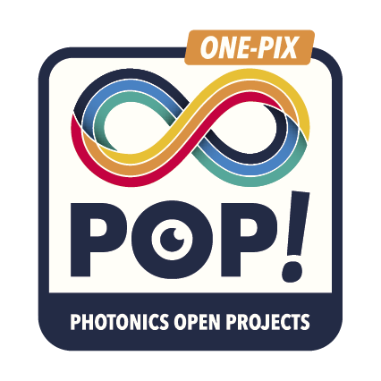

<p align="center">

</p>

# ONE-PIX kit project   #

## Introduction 

The ONE-PIX kit is an hyperspectral camera using single pixel imaging principle to measure hypercubes in the visible region. It can be enhanced towards the infrared region. This modular kit can be used with different spectrometers and optical elements for the collection. To date, it can measure scenes exposed to ambient light, but it has been primarily tested and developed for use in dimly lit indoor environments.

This kit is ideal for getting started with hyperspectral imaging or single pixel imaging. Thus it is a tool for teachers and students to discover non conventional imaging. It is also an economic tool to produce low cost hypercubes of tailored scenes or to reproduce academical results within the robotic vision field. 
To learn more about single pixel imaging theory used for hyperspectral imaging, you can read our [article. ](https://www.ncbi.nlm.nih.gov/pmc/articles/PMC7070961/)

This kit was developed with the primary need in mind to be able to be assembled on a standard fablab with laser cutting. Little wiring (all low voltage) and no soldering is required. You should find a fablab in your neighbourhood capable (and enthusiastic) of helping you build this cool instrument, especially if they can have some fun with it afterwards.

### Working principle

The ONE-PIX kit contains a video projector and a fibered spectrometer with superimposed fields of view. Both are connected and controlled by a Raspberry Pi board.
 
<p align="center">

</p>

For more information about the single pixel imaging you can go [here](https://github.com/PhotonicsOpenProjects/ONE-PIX/wiki/2.-Theoretical-principles)

ONE-PIX technology involves projecting a series of patterns onto a scene to be imaged. A spectrometer measures the average reflected spectrum of the scene for each projection. An algorithm then reconstructs the hypercube of the scene from all the spectra measured during the acquisition. 
The Raspberry Pi board ensures the synchronization between patterns projections and the spectrometer measurements.

### Architecture of the ONE-PIX kit repository 

This repository contains scripts and software embedded on the Raspberry Pi and all the information to install and use it properly. 

An other [ONE-PIX_hardware](https://github.com/PhotonicsOpenProjects/ONE-PIX_harware) repository contains all the files and information to build a case containing all the components of the ONE-PIX kit and their 3D printed attachments.


## ONE-PIX software Installation


The installation of the ONE-PIX software is achievable as the hardware installation is fully completed..
To do so, you can follow the [hardware building tutorial](https://github.com/PhotonicsOpenProjects/ONE-PIX/wiki/4.-ONE%E2%80%90PIX--Hardware) .
You can also buy an already premounted ONE-PIX  kit [here](https://www.photonics-bretagne.com/fr/product/imageur-hyperspectral-one-pix-pop/)

the ONE-PIX kit has been tested and is functional in the following environments: 

|Tested OS| Tested python version|remark|
|---|---|---|
|[Rasbian bullseye version 11 (32-Bit)](https://www.raspberrypi.com/software/operating-systems/) |3.9|tested on raspberry pi 4B + with 8 Go RAM|
|Windows 11|3.11.6| impossible to carry out [HAS measurements](https://github.com/PhotonicsOpenProjects/ONE-PIX/wiki/3.-ONE%E2%80%90PIX-measures-principles#has-method) and no RGB capture at all |

Here we assume that The ONE-PIX soft was developed to use a raspberry pi with Raspberry Pi OS.
However it possible use directly your PC with python for more advanced performance. 

This tutorial details all the steps required to install the ONE-PIX software on a Raspberry Pi 4 board. 

For troubleshooting in installation you can go to the [issue section](https://github.com/PhotonicsOpenProjects/ONE-PIX/issues)

### Installing ONE-PIX on a raspberry pi  
All instructions and tips to configure your raspberry pi board and install the ONE-PIX on it install are available [here](imgs/ONE-PIX_install_on_rasp.md). 
For otehr OS just continue to read this readme file. 


### Download git repository

The first step of this installation is to clone the ONE-PIX directory from Github.

From the Raspberry Pi, open a terminal and go to the desktop with the following command line:

```
cd Desktop
```

Download the ONE-PIX software from git 

```
sudo git clone https://github.com/PhotonicsOpenProjects/ONE-PIX.git
```

### ONE-PIX installation 

To install ONE-PIX on the raspberry pi board just run the setup.sh for that go in ther install folder with this command  :

```
cd ONE-PIX/install 
```
and run the installtion script with this command :

```
python setup.py 
```


### Spectrometer installation 

The ONE-PIX kit is compatible with many spectrometers model. All models already tested with ONE-PIX has a concrete implementation in the [spectrometers subfolder](plugins/spectrometer) of plugins. For each of them instruction of installattion on a raspberry pi board are detailed in the readme folder. 
For example you can see the [OceanInsigth](plugins/spectrometer/OceanInsight/README.md) or [Avantes](plugins/spectrometer/Avantes/README.md) installation instructions to achieve before measure with your ONE-PIX  

If you want to implement a new model of spectrometer  you need to see [adding a new spectrometer](https://one-pix.readthedocs.io/en/latest/contributing.html#adding-a-new-spectrometer) API section.


The installation is now complete. 
Now you can follow the [tutorial measure hyperspectral image](https://github.com/PhotonicsOpenProjects/ONE-PIX/wiki/1.-Quickstart-Guide) to measure your first hyperspectral datacube ! 


###  Measuring and analysing hypercubes 

The software architecture of the ONE-PIX kit offers different ways to measure, reconstruct and analyze hyperspectral images. 

<p align="center">

</p>


- The fastest way to measure and analyze hyperspectral images without write any lien of code is to use the [GUI interface](https://github.com/PhotonicsOpenProjects/ONE-PIX/wiki/1.-Quickstart-Guide)
- For more advanced acquisitions,use directly [command line interfaces](app/cli) or [python script examples](app/python_code_examples) and adapt them to your use case  with using the [API](https://one-pix.readthedocs.io/en/latest/introduction.html).
 
## Contributing 

### Mounting experience

If you use it from a already assemble kit, and do not found a detail on the manual, tell us !
If you assemble it by yourself and found some simpliest or smartest way to do it, please share !
If you encounter difficulties, have suggestions or even just cheers the developpers, do not hesitate again !

### Use Cases

Any questions, pedagogical or in a front of science, very applied or meta-conceptual are interesting for us and other users. A brief description and welcome message on this repository will be greatly apreciated. If we are curious enough we will contact you.

### New functions

As you will rapidly catch-it : this simple set-up has an infinity of potential developements, applications and usages. Feel free to play with it once it works at your place. 
If you find new tricks, feel free to share it with us and the community. We will dedicate ourselves (on the limits of our daily hours) to make the best effort to integrate and promote to the community every contribution with the greater respect to your credits. 

### Your version

If you tried a new sensors, an other mechanical plan, you can freely create your own forks but if you consider it could be usefull to keep consistency with other develepment and insturmental choice, we can discuss on intégrating also , spectormeter wrappers or even more crazy evolution in the main.

## Important remarks

:bulb: **Tip:** Do not forget to have fun... because we had some making it for you !
