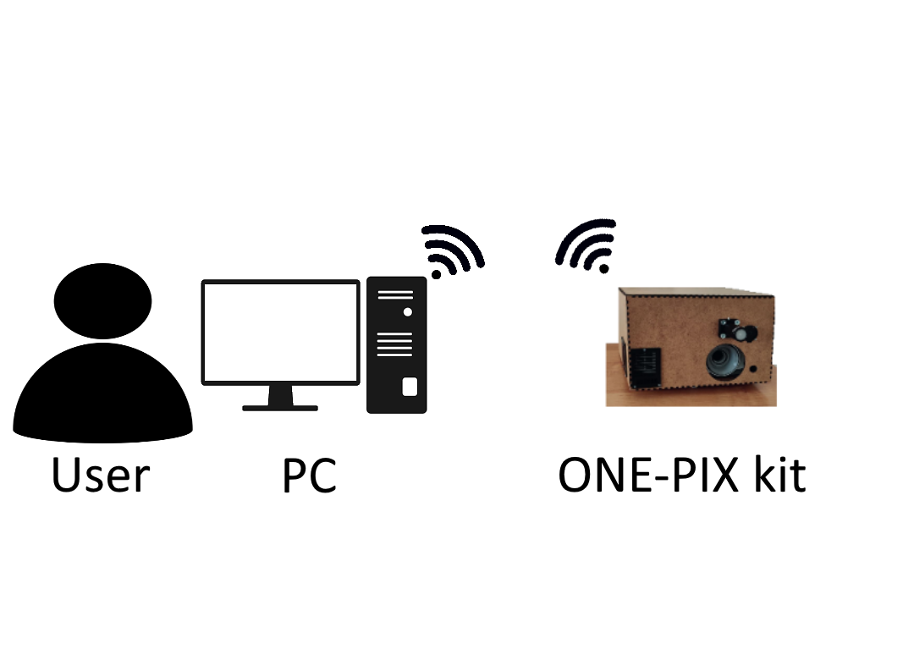
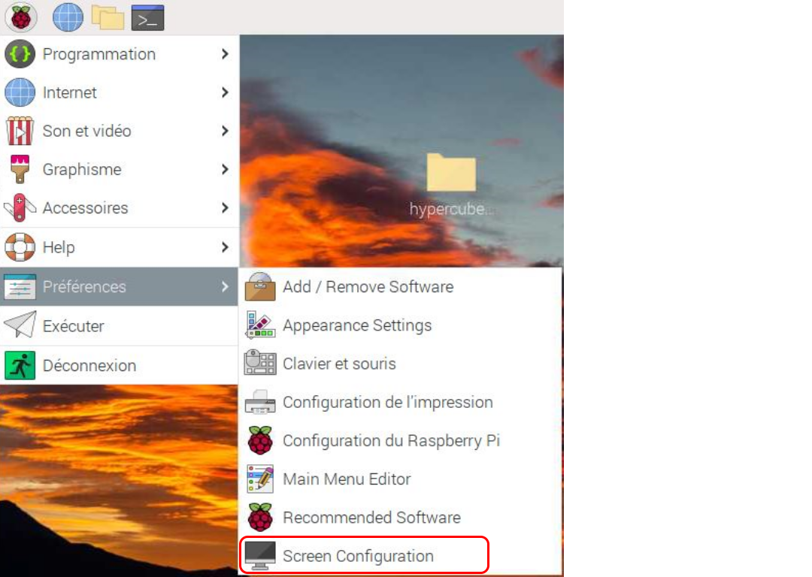
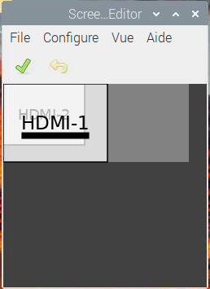
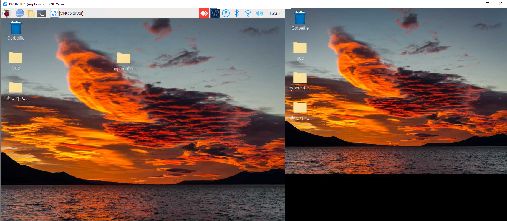

# ONE-PIX installation on raspbnerry pi 


## Raspberry pi needed setup 

The tested configuration of ONE-PIX on a raspebrry is  :

- on a raspberry pi 4B model with 8 Go RAM. 
- with [Rasbian bullseye version 11 (32-Bit)](https://www.raspberrypi.com/software/operating-systems/) OS 
- with python 3.9 

Maybe other OS and model of raspberry pi are available but not tested 


## Download and install ONE-PIX on the rasp 


### Installing the Raspberry Pi OS on the SD card and remote control

We recommend to use The ONE-PIX with a remote control Desktop.It allow you to run long acquisition in a more automated way. 

<p align="center">

</p>
 

To install the Raspbian OS on the SD card you can follow steps on this link [here](https://www.raspberrypi.org/documentation/installation/installing-images/ )

To remote control your raspberry pi you can follow this tutorial [here](https://www.realvnc.com/en/blog/how-to-setup-vnc-connect-raspberry-pi/#:~:text=You%20can%20even%20create%20and,will%20be%20able%20to%20connect. )


### Download git repository

The first step of this installation is to clone the ONE-PIX directory from Github.

From the Raspberry Pi, open a terminal and go to the desktop with the following command line:

```
cd Desktop
```

Download the ONE-PIX software from git 

```
sudo git clone https://github.com/PhotonicsOpenProjects/ONE-PIX.git
```


### Clone and install the ONE-PIX repo on your rasp 


To install ONE-PIX on the raspberry pi board just run the setup.sh for that go in ther install folder with this command  :

```
cd ONE-PIX/install 
```
and run the installtion script with this command :

```
. install.sh 
```

## Configure the raspberry pi 

### Activate Raspberry Pi camera 

to use ONE-PIX kit you need to activate the raspberry pi camera for that go 


Enable SSH,VNC and the camera 

<p align="center">

</p>

If you want to implement another model of camera on the ONE-PIX you need to see [here]() 

### Dual screen configuration
In order to perform ONE-PIX  measurements, it is necessary to set up a second screen dedicated to displaying the patterns to be projected on your scenes.
 
You need to change the boot/config.txt file of the Raspberry Pi to force the double screen stored in DLL folder. 
You need to supress your existing boot/config.txt and replace it by  preconfiguring config file stored in the[install folder](../ONE-PIX _soft/src/DLL).
For that use these command lines : 

```
sudo rm /boot/config.txt
sudo cp ~/Desktop/ONE-PIX/ONE-PIX_soft/src/DLL/config.txt /boot
```


### Finalisation and checking of the installation

First, shutdown the Raspberry Pi and replug in the hardware benchtop. 
Then, plug the mini HDMI on the HDMI1 port.  
Power on the projector and the Raspebrry Pi board. 
Remote control your Pi with your computer.

Now, you need to configure screen display. For that, go in the screen configuration menu:

<p align="center">

</p>

This window will pop up:

<p align="center">

</p>

The HDMI1 and HDMI2 are superimposed. You need to grab HMDI 2 at the right of HDMI 1 with the mouse. 

<p align="center">

</p>

Now with VNC Viewer you can see two screens. The first one is the screen of the Raspberry
Pi desktop and the second is the screen of the projector. 

set the resolution of the screen 1 with 1024x768 pix and the screen 2 in 600x800pix. 

click one the green ticks to validate changes.

:warning: **Warning:** For long acquisition it may be necessary to deactivate the sleepmode. you can follow this [tutorial](https://pimylifeup.com/raspberry-pi-screensaver/)

<p align="center">

</p>

The installation is now complete. 
Now you can follow the [tutorial measure hyperspectral image](/ONE-PIX_soft/doc/tutorial_measure_hyperspectral_image.pdf) to measure your first hyperspectral datacube ! 


